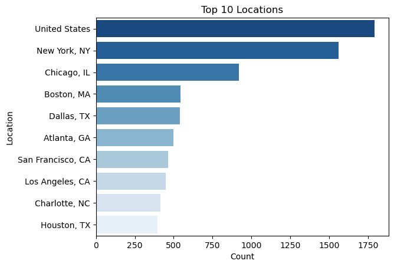
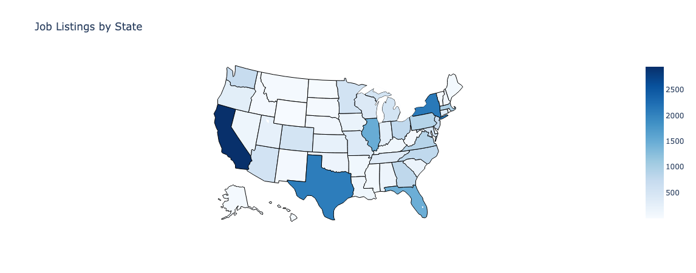
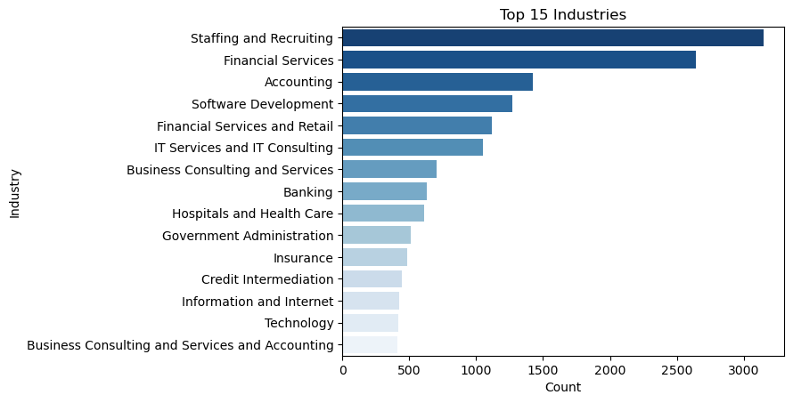

# Analyzing Finance Job Postings

## Purpose

As a finance and management information systems major I wanted to learn more about the current (2022) job market before entering within the next couple years. 

### Questions

- **Where are the most jobs located?**
- **Which industries have the most jobs?**
- **How can I best prepare myself for getting a job, what skills are in demand beyond an education in Finance?**
- **Would my MIS degree make me more marketable?**

## Data Collection

For this project I developed a Python script, [linkedin-job-scraper](https://github.com/Daneski13/linkedin-job-scraper), to scrape public job listings on LinkedIn. LinkedIn is one of the most popular platforms for job seekers, making it one of the best websites to gather data on the job market.

### Methodology

From September 28th through October 4th, I scraped LinkedIn's job listings each day with the search keyword "Finance" and location of United States. Filtering for the last 24 hours, the seniority/experience levels of Internship, Entry Level, and Associate with the job types of Full Time, Internship, and Other. I was looking to collect information on Full Time jobs available to those with about 0-3 years experience in the field ("entry jobs") and these filters would produce the most relevant data for my questions. Queries used LinkedIn's default "Most relevant" sorting in an attempt to get the best data pertaining to the "Finance" keyword.

Because LinkedIn will only display up to 1000 listings per search, I was unfortunately unable to scrape the entirety of the listings posted each day. I used separate search queries for each seniority level and further broke down those queries by filtering each for remote, hybrid, or on-site for the widest coverage. Gathering more data would not be possible without using highly specific filters introducing bias.

### Data Structure

| Col             | Definition                                        |
| --------------- | ------------------------------------------------- |
| date_scraped    | date the listing was scraped                      |
| title           | title of the job listing                          |
| full_url        | LinkedIn URL of the job posting                   |
| company         | company name                                      |
| company_url     | company's LinkedIn URL                            |
| location        | job's location                                    |
| description     | raw HTML of the job's description                 |
| seniority_level | job's seniority level                             |
| employment_type | job's employment type (Full Time, Part Time etc.) |
| job_function    | job's expected functions                          |
| industries      | industries the company is in                      |

## Findings

### Where are the most jobs located?

New York City and Chicago have the greatest proportion of the jobs relative to other cities in the United States. 

The states of California, New York, Texas, Illinois, and Florida have the most jobs overall.
  
### Which industries have the most jobs?

Unsurprisingly jobs directly in the financial services industry are the most common, Software development, IT, Information/Internet, and Technology make up numbers 4, 6, 12, and 13 respectively.

### How can I best prepare myself for getting a job, what skills are in demand beyond an education in Finance?

Excel is the most in demand skill, being mentioned in 25% of the job descriptions. Database, and Data Analysis are second and third, both around 10%.

SQL, Tableau, and Power BI were mentioned in about 1% of the postings, however these skills may set a job candidate apart from others seeking the same role.

### Would my MIS degree make me more marketable?

Database knowledge, data analysis skills, and SQL are in demand skills and are covered in the MIS degree program. Also, technology related industries are common in the top 15 industries. In these industries information systems domain knowledge may be useful.
